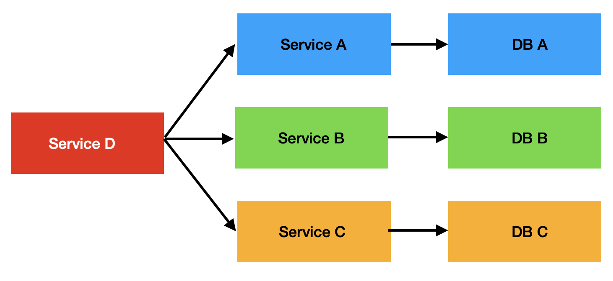
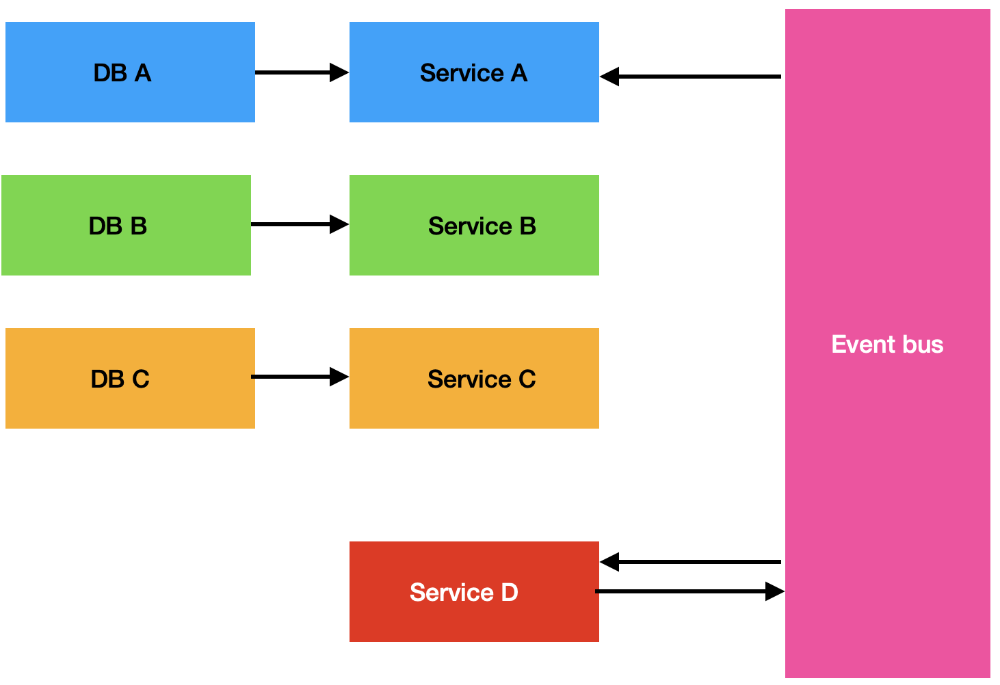
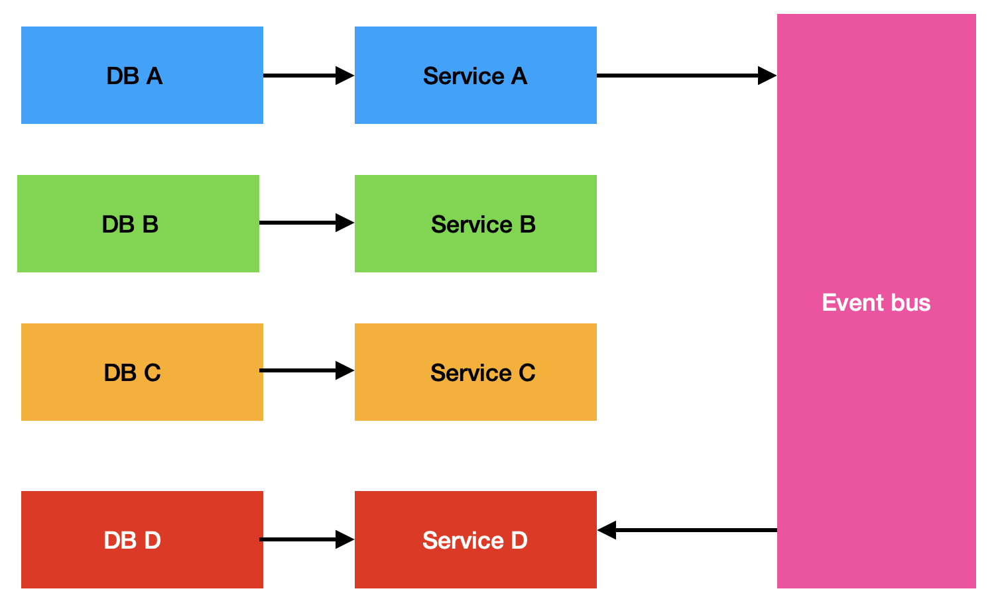

# Microserivces projects

The repo contains serveral microservices projects.

1. Beginner: [Blog](./blog/README.md)

## Basic ideas

Microservices are the number one solution for **building and scaling out apps**. It prevents that one service crash causes the entire system down.

The main idea of microservices is **each service has its own database if needed**.

We have 3 approaches to build microservices.

- Sync Communication Between Services

  

  The request is received by Service D.

  Cons:

  - easy to implement
  - Service D don't need a database

  Pros:

  - Dependency between service:

    - Internal services crash can shut down the services depended on them.
    - The entire request is as fast as the slowest internal request.

- Async event bus

  

  The request is received by Service D.

  Cons and Pros are same to the previous structure.

- Hybird

  It merges previous 2 approaches.

  **Service D has its own database**. When it receives the request, it will query its own database.

  However, database D needs the data from other services. So when other sevices (i.e. Service A) receive requests, they will not only response the resquest, but also **send the related data to Service D using event bus**.

  
